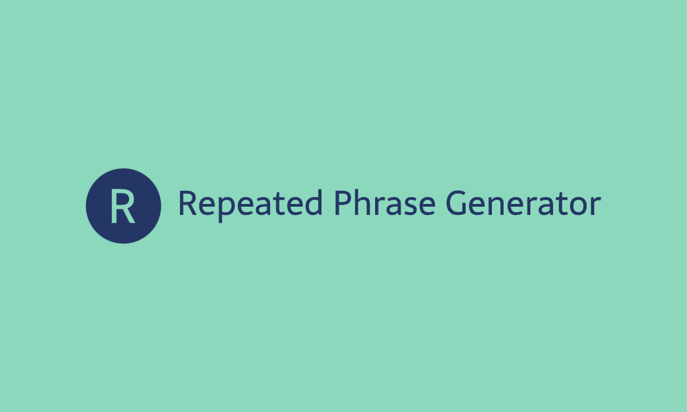

# Repeated Phrase Generator

Repeated Phrase Generator は、選択したテキストを特定の形式「〇〇の〇〇」に変換する Chrome 拡張機能です。
音声読み上げ機能とコピー機能を備えており、変換形式はひらがなとカタカナがあります。

「〇〇の〇〇」形式とは、文字列の先頭二文字を繰り返し表示した後に、選択した文字列全体を表示する形式のことを指します。例えば、コミットという文字列から「こみこみのコミット」という文字列が生成されます。

## インストール方法

1. [リリースページ](https://github.com/ryo-manba/repeated_phrase_generator/releases)から最新の `repeated-phrase-generator-v{バージョン}.zip` をダウンロードし、ローカルで展開します。
2. Google Chrome のアドレスバーに chrome://extensions と入力して拡張機能のページにアクセスします。
3. 右上のデベロッパーモードをオンにします。
4. `パッケージ化されていない拡張機能を読み込む`をクリックし、1 で展開したしたフォルダを選択します。

## 使い方

1. 適当なテキストを選択すると、拡張機能のアイコンが表示されます。
2. アイコンをクリックするか、右クリックでコンテキストメニューを表示し、`選択したテキストを変換`を選択します。
3. 変換後のテキストは音声の読み上げとクリップボードへコピーすることができます。

## Demo

